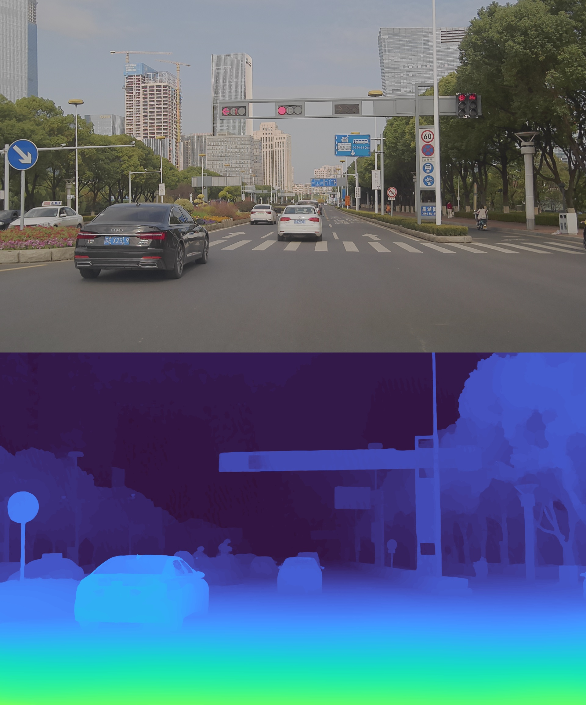

# Stereo-matching-python
Python implementation of various stereo matching algorithms.

> Author: pgcai [https://github.com/pgcai] 

## Show results
RAFT:
<!--  -->
<div align="center">  </div>
CSTR:

StereoNet:


## Quick Start
```python

```

### References
> x